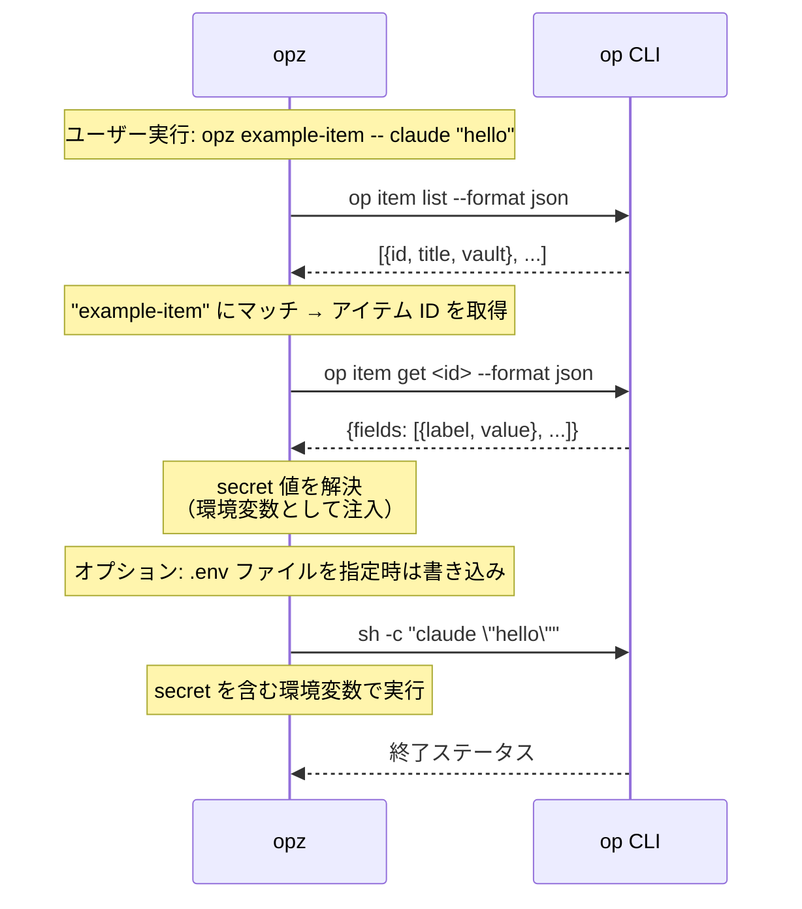

# opz

`opz` は 1Password CLI の小さなラッパーです。アイテムを探し、有効なフィールド名を環境変数に変換し、その secret を入れた状態でコマンドを実行できます。

## 機能

* タイトルのキーワードで 1Password アイテムを検索します。
* `doctor` で `op` の認証状態、任意の依存 CLI、平文の `.env` 系 credential ファイルをチェックします。
* shell の環境変数名として使えるフィールドラベルを表示します。
* 1Password MCP server 経由で、secret 値を表示せずに 1Password Developer Environments を管理します。
* concealed placeholder 変数の追加と、server が公開する MCP tool 一覧の確認ができます。
* 1 つ以上の 1Password アイテムから secret を取得してコマンドを実行します。repository title による item 自動検出にも対応します。
* 公式 `opz-plugin` registry のintegrity pin済み declarative launch pluginを適用します。
* `op` CLI が対応している場合、`--environment` で 1Password Environments の native injection に委譲してコマンドを実行します。
* `op://...` 参照を含む env ファイルを生成し、既存ファイルの無関係な行は残します。
* 既存 script を、明示 item や `.env` から repository title と metadata ベースの管理へ migrate できます。
* private 設定ファイルを Secure Note として保存します。
* 有効なアイテムフィールドを GitHub repository secrets に保存し、item 側の repository metadata があれば誤配を防ぎます。
* Cloudflare API token、Worker secrets、redact済みAPI responseを1Passwordへ取り込みます。
* 有効なアイテムフィールドを Wrangler 経由で Cloudflare Worker secrets に保存します。
* bundled `opz` Agent Skill を出力します。
* fuzzy lookup と legacy migration path 用に、アイテムリストと repository metadata を 60 秒キャッシュします。

## インストール

[`cargo binstall`](https://github.com/cargo-bins/cargo-binstall) でビルド済みバイナリを取得:

```bash
cargo binstall opz
```

または、ソースからビルド:

```bash
cargo install opz
```

## 使い方

### アイテム検索

タイトルのキーワードで 1Password アイテムを検索します:

```bash
opz find <query>
```

例:
```bash
opz find github
# 出力: <item-id>    <vault-name>    github-token
```

### Doctor

1Password CLI の状態と外部コマンド依存をチェックします:

```bash
opz doctor
```

`doctor` は必須の `op` チェックが失敗した場合だけ非 0 で終了します。1Password MCP server、`gh`、`wrangler`、`git`、`sh`、`secretlint` など任意ツールの欠落は警告として表示します。1Password Desktop SDK の read path も probe し、利用できない場合は **Settings → Developer → Integrate with the 1Password SDKs → Integrate with other apps** を有効にするよう案内します。平文の `.env` 系 credential ファイルもチェックし、`secretlint` が使える場合はそのファイルに対して実行します。

### アイテムラベル表示

環境変数名として使えるフィールドラベルを表示します:

```bash
opz show [OPTIONS] [--with-item] <ITEM>...
```

オプション:
* `--vault <NAME>` - Vault 名（省略時はすべての Vault を検索）
* `--with-item` - アイテムごとの見出しを表示

例:
```bash
# ラベル名のみ（1行1ラベル）
opz show foo bar

# アイテム見出し付きで表示
opz show --with-item foo bar
```

### Agent Skill を出力

`opz` 用の bundled Agent Skills `SKILL.md` を出力します:

```bash
opz skills
```

これにより、他の agent や tool は Agent Skills 標準形式で `opz` の利用コンテキストをそのまま読み込めます。

### 1Password Environments 管理

1Password MCP server を使って、Developer Environments の作成、リネーム、変数名確認、local `.env` mount を行います。`--account <ACCOUNT_ID>` を省略すると、MCP 経由で 1Password app に認証します。

```bash
opz environment list
opz environment create dev
opz environment rename dev staging
opz environment variables dev
opz environment add dev API_TOKEN DB_URL
opz environment mount dev .env.local
opz environment mounts dev
opz environment tools

# 短縮 alias
opz env list
```

`opz environment variables` は変数名だけを表示します。`opz environment add` は空文字の concealed placeholder を作成するため、secret 値を argv や `opz` の出力へ載せません。値は 1Password app で設定します。`opz environment mount` は MCP server に synced local `.env` mount の作成を依頼し、`opz` 自身は secret 値を書きません。`opz environment tools` は account 認証を行わず、MCP `tools/list` が返した tool 名を表示します。

公式の bundled executable は `1password-mcp` です。互換性のため、旧名 `onepassword-mcp` も fallback として認識します。明示的な executable path を使う場合は `OPZ_1PASSWORD_MCP_COMMAND`、既定30秒の応答 timeout を変更する場合は `OPZ_MCP_TIMEOUT_SECONDS` を設定します。

### Declarative Plugin

`opz` は公式 `opz-plugin` registry のreview済みsnapshotを同梱します。plugin manifestは実行コードではなく宣言データです。許可されたtargetの選択、明示allowlistされたitem fieldの投影、検証済みargumentの追加、contained temporary config fileの生成だけを扱います。script、installer、hook、任意subprocess、wildcard secret accessは記述できません。

```bash
opz plugin list
opz plugin show codex-openai@1.0.0
opz plugin run codex-openai@1.0.0 --item owner/repo -- codex
```

pluginを使うitemはimmutableなregistry releaseをpinします:

```text
OPZ_PLUGIN_SCHEMA_VERSION=1
OPZ_PLUGIN=codex-openai
OPZ_PLUGIN_SOURCE=github:opz-rs/opz-plugin/plugins/codex-openai
OPZ_PLUGIN_VERSION=1.0.0
OPZ_PLUGIN_SHA256=89f1fd0e0ac35669a620a2ddce10230635ff432453930ee691858629bb2062ce
OPZ_PLUGIN_CONFIG=
OPENAI_API_KEY=<concealed field>
```

通常の `opz run` でも、選択itemが1件で `OPZ_PLUGIN` を持つ場合は自動適用します。plugin metadataはchild environmentへ渡しません。secretを解決する前に、registry digest、manifest schema、source/version pin、target allowlist、config type、secret allowlist、generated path containment、release lifecycleをruntimeで再検証します。revoked releaseは常に拒否し、deprecated releaseは `opz plugin run` の明示的な `--allow-deprecated` が必要です。

`OPZ_PLUGIN_REGISTRY_DIR` には `registry.toml` と `plugins/.../plugin.toml` を含む明示的なlocal checkoutを指定できます。local entryも正確なSHA-256検証が必須で、network fetchや実行可能plugin codeは有効になりません。

### 削除済みの `create` コマンド

`opz create` は item を作成しません。古い script が unknown command で失敗しないよう、隠し互換コマンドとして残し、移行先を示すエラーを返します。

代わりに次を使います:

```bash
# .env から API_CREDENTIAL item を作成し、対応 script を migrate
opz migrate --new

# .env 以外の private file を Secure Note item として保存
opz note app.conf
```

### Secret 付きでコマンド実行

1 つ以上の 1Password アイテムから secret を取得してコマンドを実行します:

```bash
opz run [OPTIONS] [--env-file <ENV>] [<ITEM>...] -- <COMMAND>...
opz [OPTIONS] [--env-file <ENV>] [<ITEM>...] -- <COMMAND>...
opz run --environment <ENV> -- <COMMAND>...
opz --environment <ENV> -- <COMMAND>...
```

オプション:
* `--vault <NAME>` - Vault 名（省略時はすべての Vault を検索）
* `--env-file <ENV>` - 出力 env ファイルパス。省略時はファイルを書きません。
* `--environment <ENV>` / `--environments <ENV>` - item lookup の代わりに、`op run` 経由で 1Password Environments の native injection を使います。

引数:
* `<ITEM>...` - secret を取得する任意のアイテムタイトル。省略時は git remote repository 名（例: `owner/repo`）と完全一致する title を探し、一致しなければ標準 website と `origin` を照合します（後述）。

`--env-file` を指定すると、env ファイルはコマンド終了後も残り、解決済みの値ではなく `op://` 参照を含みます。既存の通常ファイルは permission と無関係な内容を保ったまま安全に置換し、symlink と通常ファイル以外の target は拒否します。Unix で新規作成するファイルは mode `0600` です。複数アイテムで同じキーがある場合は後勝ちです（`opz run foo bar ...` では `bar` の値が優先）。

例:
```bash
# .env ファイルを生成せずに1アイテムで実行
opz run example-item -- your-command

# git remote title から item を自動検出
opz run -- your-command

# 複数アイテムで実行（重複キーは後勝ち）
opz run foo bar -- your-command

# 他の tool が op:// 参照ファイルを必要とするときだけ env ファイルを生成
opz run --env-file .env foo bar -- your-command

# 短縮形でも複数アイテム対応
opz --env-file .env.local foo bar -- your-command

# 信頼する child が環境変数を直接読む
opz run my-service -- your-command

# または、明示的に信頼する child shell 内で stdin に渡す
opz run my-service -- sh -c 'printf "%s" "$API_TOKEN" | trusted-consumer --token-stdin'

# Vault を指定
opz run --vault Private foo bar -- your-command

# opz 側で値を解決せず、1Password Environment を使う
opz run --environment dev -- your-command
```

Environment mode は v1 では item 引数や `--env-file` と同時に使えません。`opz` は `op run` に実行を委譲し、Environment の secret 値を読みません。インストール済みの `op` CLI が Environment runtime injection を公開していない場合、`opz` は明確なエラーを返し、従来の item-backed workflow はそのまま使えます。

`opz` は command 引数を変更せずに渡し、解決済みの値を argv 内の `$VAR` や `${VAR}` に代入しません。値は child の環境変数だけに渡され、child は明示的な trust boundary です。詳細は [Secret-handling security policy](docs/security.md) を参照してください。

item title に一致する候補がなければ、1Password item の標準 website に登録した repository URL と `origin` を照合します。たとえば website が `https://github.com/acme/my-app` なら、origin が `git@github.com:acme/my-app.git` の repository で次のように実行できます。item 名は自由です。

```sh
opz run -- npm run dev
```

ホスト名と repository の全パスを照合します。アプリの公開 URL から repository は推定しません。複数 item が一致する場合は、item を明示してください。初回は選択した Vault（`--vault` 未指定なら全 Vault）の item を読み取り、item ID と正規化した repository 情報だけを 60 秒キャッシュします。website の生 URL や credential は保存しません。ポート付き URL、query、fragment、percent encoding は照合対象外です。

### Env ファイル生成

コマンドを実行せず、`op://...` の env 参照を生成します:

```bash
opz gen [OPTIONS] [--env-file <ENV>] <ITEM>...
```

例:
```bash
# セクション付きで標準出力
opz gen foo bar

# .env ファイルを生成
opz gen --env-file .env foo bar

# カスタムパスに生成
opz gen --env-file .env.production foo bar

# Vault を指定
opz --vault Private gen foo bar
```

標準出力では `# --- item: <title> ---` のようなコメント見出しを付けます。ファイル出力では、セクションコメントなしのマージ済みキー一覧を書きます。

### Script と `.env` の migrate

`justfile` / `Justfile` の recipe と `package.json` の scripts を、repository item title と metadata へ移行します:

```bash
opz migrate [OPTIONS]
```

オプション:
* `--dry-run` - 1Password item やファイルを編集せず、変更内容だけを表示
* `--new` - `.env` から新しい `API_CREDENTIAL` item を作成してから `.env` ベースの script を書き換えます。item 名は先頭の git remote repository 名です。
* `--restore` - itemless な `opz run --` に移行済みの script を、明示 item 付きの呼び出しに戻します。
* `--vault <NAME>` - Vault 名（省略時はすべての Vault を検索）

挙動:
* `opz run <ITEM> -- <COMMAND>` と `opz <ITEM> -- <COMMAND>` は、デフォルトでは明示 item のまま残します。`migrate` は repository metadata を記録し、item と repository がそれぞれ 1 件だけなら item title と対応する Just item 変数を `owner/repo` に揃えます。
* `opz migrate --restore` は、itemless な `opz run -- <COMMAND>` を、Just recipe parameter または現在の repository title から推定した `opz run <ITEM> -- <COMMAND>` に戻します。
* `op item get <ITEM>` は metadata 登録の手がかりとして使いますが、`opz run` と等価ではないため書き換えません。
* `.env` ベースの script は `--new` 指定時だけ書き換えます。指定がない場合は報告してスキップします。
* `--dry-run` は item 詳細を取得せず、追加される repository metadata を表示します。
* `package.json` は該当する script 文字列だけを置き換えるため、それ以外の key 順や整形は維持します。

例:
```bash
# 変更内容だけ確認
opz migrate --dry-run

# script を書き換え、item metadata を更新
opz migrate

# .env から新しい item を作成して migrate
opz migrate --new

# itemless auto-detection に移行済みの script を戻す
opz migrate --restore
```

### Private 設定ファイルを Secure Note として保存

private 設定ファイルを git remote 由来のタイトルで Secure Note item として保存します:

```bash
opz note <FILE>
```

挙動:
* 本文は ```` ```<file name>\n<content>\n``` ```` の形で保存します。
* タイトルには git remote URL から抽出した `org/repo` を使います。
* remote が複数ある場合は remote ごとに作成し、同名時は `-2`, `-3` のように番号を付けます。
* 解釈できる git remote がない場合はエラー終了します。

例:
```bash
opz note app.conf
opz --vault Private note app.conf
```

### 既存 item に GitHub Repository Metadata を追加

既存の 1Password item に `github_repositories` metadata を追加または更新します:

```bash
opz github-repo [OPTIONS] <ITEM>...
```

オプション:
* `--repo <OWNER/REPO>` - 記録する repository。複数回指定できます。省略時は現在の repository の git remote から解釈できる値を使います。
* `--dry-run` - item を編集せず、更新内容だけを表示
* `--vault <NAME>` - Vault 名（省略時はすべての Vault を検索）

例:
```bash
# 現在の git remote を使った migration を事前確認
opz github-repo --dry-run my-service shared-secrets

# 現在の git remote repository metadata を追加
opz github-repo my-service shared-secrets

# 明示した repository を追加
opz github-repo --repo owner/repo --repo other/service my-service
```

既存の `github_repositories` は残し、指定した repository とマージします。

### GitHub Repository Secrets に保存

有効なアイテムフィールドを GitHub repository secrets に保存します:

```bash
opz github-secret [OPTIONS] <ITEM>...
```

オプション:
* `--repo <OWNER/REPO>` - 保存先 GitHub repository（省略時は現在の `gh` repository）
* `--dry-run` - 値を書き込まず、保存対象の secret 名だけを表示
* `--vault <NAME>` - Vault 名（省略時はすべての Vault を検索）

例:
```bash
# secret 名を事前確認
opz github-secret --dry-run my-service

# 現在の repository に保存
opz github-secret my-service

# repository を指定して保存
opz github-secret --repo owner/repo my-service shared-secrets
```

`github-secret` は `gen` や `run` と同じ有効フィールドラベルを使います。複数 item で同名がある場合は後勝ちです。Secret 値はメモリ上で解決し、`gh secret set` の stdin に渡します。値を表示したりコマンド引数に載せたりしません。GitHub が予約しているため、`GITHUB_` で始まる名前は拒否します。

選択した 1Password item に `github_repositories` フィールドがある場合、保存先 repository はその `owner/repo` 一覧のいずれかと一致する必要があります。一覧は改行またはカンマ区切りで複数指定できます。この metadata がない item は従来通り利用できますが、repository guard を適用できないため警告を表示します。

### Cloudflare credential と API response を取り込む

secret値をargv、設定ファイル、ログへ載せず、Cloudflare関連データをexact-titleの1Password itemへ保存します:

```bash
opz cloudflare-credential --preset <PRESET> --item <ITEM> [OPTIONS] --stdin
opz cloudflare-credential --preset <PRESET> --item <ITEM> [OPTIONS] --file <JSON>
opz cloudflare-credential --preset <PRESET> --item <ITEM> [OPTIONS] -- <COMMAND>...
```

Preset:
* `api-token` - 1つのAPI tokenをconcealed fieldへ保存します。既定sectionは`Cloudflare`、fieldは`CLOUDFLARE_API_TOKEN`です。
* `worker-secret` - 1つのsecret、またはJSON objectのtop-level keyを複数のconcealed fieldとして保存します。既定sectionは`Worker Secrets`です。
* `api-response` - JSON responseをconcealed fieldへ保存します。既定では`Authorization`、`Cookie`、token/secret/key系fieldを再帰的に`[REDACTED]`へ置換します。

Options:
* `--mode <create|update|upsert>` - item作成方針。既定は`upsert`です。
* `--vault <NAME>` - exact item lookupと書き込み先vaultを限定します。
* `--section <SECTION>` / `--field <FIELD>` - presetの保存先labelを上書きします。
* `--raw` - API responseのredactを無効化します。他presetでは拒否され、未加工responseを保持する必要がある場合だけ使います。
* `--dry-run` - 入力をparse・検証し、create/update判定と保存先referenceだけを表示します。

例:
```bash
# stdinからAPI tokenを保存
printf '%s' "$CLOUDFLARE_API_TOKEN" |   opz cloudflare-credential --preset api-token --item cloudflare-prod --stdin

# JSON fileから複数Worker secretsを保存
opz cloudflare-credential --preset worker-secret --item worker-prod   --section production --file worker-secrets.json

# command outputのCloudflare API responseをredactして保存
opz cloudflare-credential --preset api-response --item cloudflare-audit   --field zones -- cloudflare-client zones list --json
```

Create/updateは完全な1Password JSON item templateを`op item create`または`op item edit`のstdinへ渡します。保存fieldはconcealed typeです。成功時は`op://<vault_id>/<item_id>/<section_id>/<field_id>`だけを表示し、取り込んだ値は表示しません。入力commandが失敗した場合もcredential漏えい防止のためstderr本文を表示しません。入力上限は16 MiBです。

### Cloudflare Worker Secrets に保存

有効なアイテムフィールドを Wrangler 経由で Cloudflare Worker secrets に保存します:

```bash
opz cloudflare-secret [OPTIONS] <ITEM>...
```

オプション:
* `--name <WORKER>` - `wrangler secret bulk --name` に渡す Worker 名
* `--env <ENV>` - `wrangler secret bulk --env` に渡す Wrangler environment
* `--config <PATH>` - `wrangler secret bulk --config` に渡す Wrangler config path
* `--dry-run` - 値を書き込まず、保存対象の secret 名だけを表示
* `--vault <NAME>` - Vault 名（省略時はすべての Vault を検索）

例:
```bash
# secret 名を事前確認
opz cloudflare-secret --dry-run my-service

# 現在の Wrangler project config を使って保存
opz cloudflare-secret my-service

# Worker と environment を指定して保存
opz cloudflare-secret --name worker-app --env production my-service shared-secrets
```

`cloudflare-secret` は `gen` や `run` と同じ有効フィールドラベルを使います。複数 item で同名がある場合は後勝ちです。Secret 値はメモリ上で解決し、JSON として `wrangler secret bulk` の stdin に渡します。値を表示したりコマンド引数に載せたりしません。

## 仕組み

1. item title が指定されている場合、まず `op item get <title>` で直接取得します。
2. 直接 lookup で見つからない場合だけ item list を取得・キャッシュし、タイトルの部分一致を使います。
3. item title が省略されている場合、git remote を読み、`owner/repo` のような item title を直接 lookup します。legacy の `github_repositories` scan は `OPZ_AUTODETECT_LEGACY_SCAN=1` の場合だけ使います。
4. item が決まると、その item を取得し、有効な env ラベルを持つフィールドから `op://<vault_id>/<item_id>/<field>` 参照を作ります。
5. `--env-file` 指定があれば、参照をファイルに書き込み、既存ファイルの無関係な行は残します。通常は file-free な `opz run` を使い、env ファイルは `op://` 参照を必要とする tool 向けです。
6. `op run --env-file <temp> -- sh -c 'env -0'` で secret をまとめて解決し、timeout 以外の失敗では参照ごとに `op read` へフォールバックします。
7. 解決済みの値を環境変数に入れ、argv は変更せずにコマンドを実行します。shell 展開は、利用者が信頼する child として明示的に起動した shell 内でだけ行われます。

`gen` は参照を書いたところで終了します。`show` は secret 値を解決せず、有効なラベルだけを表示します。

secret 解決用の `op` 呼び出しはデフォルトで 30 秒 timeout します。遅い 1Password CLI 操作を許可するには `OPZ_OP_TIMEOUT_SECONDS=<秒>` を設定してください。batch 解決が timeout した場合は、secret ごとの retry でさらに待たず即座に停止します。

## `op` コマンドの利用

セキュリティの透明性のため、`opz` が `op` CLI をどのように利用するかを示します:



セキュリティ: `opz` は secret へのアクセスと認証を `op` CLI に任せます。60 秒キャッシュするのは item list と repository metadata だけで、secret 値は保存しません。

## 要件

Desktop SDK fast path を使う場合は、1Password desktop app で **Settings → Developer → Integrate with the 1Password SDKs → Integrate with other apps** を有効にし、`opz doctor` で接続を確認します。SDK が利用できず `op` CLI へ安全に fallback する場合、`opz` は同一 invocation で一度だけ stderr に設定導線を表示し、raw SDK error は出力しません。

[1Password CLI](https://developer.1password.com/docs/cli/) (`op`) をインストールし、認証してから secret-backed command を使います。

`github-secret` には GitHub CLI (`gh`) が必要です。`cloudflare-secret` には Wrangler (`wrangler`) が必要です。`migrate` と `note` は repository remote を読むために Git (`git`) を使います。

`opz environment` は対応する 1Password desktop build に bundled された公式 `1password-mcp` を使用します。1Password app の **Settings > Labs > MCP Server** と **Settings > Developer > Integrate with MCP clients** を有効にします。明示的な executable path が必要な場合だけ `OPZ_1PASSWORD_MCP_COMMAND` を設定します。

## 1Password Environments と MCP

`opz` は 1Password Environments を置き換えるのではなく、補完します。`opz environment` は 1Password MCP server を使い、secret 値を agent に返さずに Environment 作成、変数名確認、placeholder 追加、server tool 確認、local `.env` mount を行います。native `op run` Environment injection が使える環境では、repo-local な実行補助として `opz run --environment <ENV> -- <COMMAND>` を使います。既存の vault item workflow、repository title 自動検出、deploy secret sync には、item-backed な `opz run`、`migrate`、`github-secret`、`cloudflare-secret` を引き続き使います。

## E2Eテスト

実際の1Passwordを使うe2eテストは `tests/e2e_real_op.rs` にあります。

安全のため、`OPZ_E2E=1` を指定した場合にのみ実行されます:

```bash
OPZ_E2E=1 cargo test --locked --test e2e_real_op -- --nocapture
```

または `just` で実行できます:

```bash
just e2e
```
